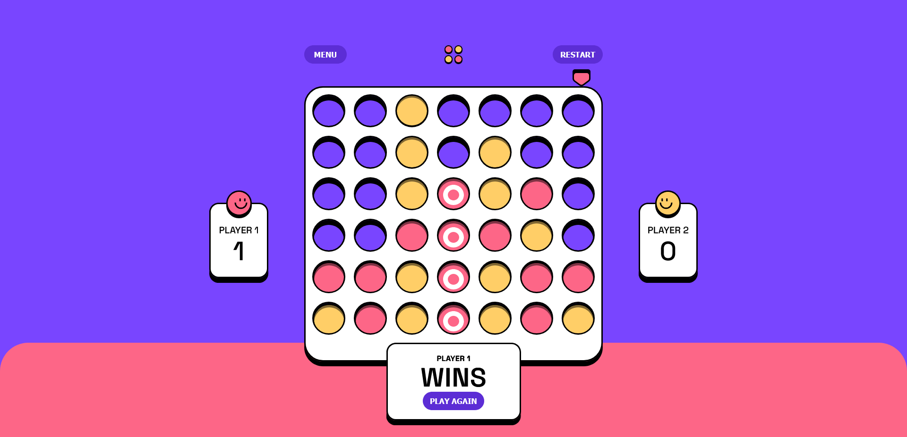

# Frontend Mentor - Connect 4 web app

This is a solution to the [Connect 4 web app challenge on Frontend Mentor](https://www.frontendmentor.io/challenges). Frontend Mentor challenges help you improve your coding skills by building realistic projects.

<br/>

## Table of contents

- [Overview](#overview)
    - [The challenge](#the-challenge)
    - [Screenshot](#screenshot)
    - [Links](#links)
- [My process](#my-process)
    - [Built with](#built-with)
    - [What I learned](#what-i-learned)
    - [Continued development](#continued-development)
    - [Useful resources](#useful-resources)
- [Author](#author)
- [Acknowledgments](#acknowledgments)

---

## Overview

### The challenge

Users should be able to:

- Play a classic game of Connect 4 against another human player.
- **(Bonus)** Play against a CPU with AI logic (implemented using Minimax with alpha-beta pruning).
- View the game in both desktop and mobile layouts.
- See hover states for interactive elements (columns on hover, etc.).
- Restart or pause the game at any time.
- Easily switch between different game modes (Player vs. Player, Player vs. CPU).
- Keep track of the current player’s turn, and visually highlight the winner.

### Screenshot



### Links

- **Solution URL:** [Add solution URL here](https://your-solution-url.com)
- **Live Site URL:** [https://danielclement37.github.io/Connect-4](https://danielclement37.github.io/Connect-4)

---

## My process

### Built with

- Semantic **HTML5** markup
- **CSS** and custom styling
- **Flexbox** layout
- **Mobile-first** workflow
- [**React**](https://reactjs.org/) – for building the interface
- **Context API / Reducer** – global state management
- **TypeScript** – for type-safe React components
- **Minimax** algorithm with alpha-beta pruning – for CPU’s decision-making

### What I learned

- **Deep Cloning** vs. shallow copying board data:  
  Learned that for a Connect 4 board state, a shallow copy can lead to bugs (shared references). A deep copy prevents issues where the AI or next turn sees stale data.
- **Minimax Implementation**:  
  Gained experience implementing a recursive minimax algorithm with alpha-beta pruning in a real project, including an evaluation function that scores the board based on possible four-in-a-row windows.
- **React Context + Reducer** pattern:  
  Used `useReducer` for game state transitions and `useContext` to manage global states like the running status, current player, etc.

```js
// Snippet of my CPU player function
export function findBestMove(boardState: Cell[][], depth: number, aiPlayer: Player): number {
    let bestScore = NEG_INFINITY;
    let bestColumn = -1;

    const possibleMoves = getPossibleMoves(boardState);
    if (possibleMoves.length === 0) {
        return bestColumn;
    }

    for (const move of possibleMoves) {
        const clonedBoard = cloneBoard(boardState);
        placePiece(clonedBoard, move.col, aiPlayer);

        const score = minimax(
            clonedBoard,
            depth - 1,
            NEG_INFINITY,
            POS_INFINITY,
            false,
            aiPlayer
        );

        if (score > bestScore) {
            bestScore = score;
            bestColumn = move.col;
        }
    }

    return bestColumn;
}
```

Continued development

- Enhanced AI: I plan to improve the CPU logic with deeper search or better heuristics (like center-column prioritization).
- Backend / Online Play: Potentially integrate a backend so two players can compete online in real-time.

Useful resources

- The Markdown Guide – Great reference for writing clean and structured Markdown.
- Alpha-Beta Pruning (Wikipedia) – Helped clarify the pruning logic used for the CPU’s decision-making.
- CSS-Tricks on Flexbox – Useful for quickly referencing flexbox properties when creating responsive layouts.

Author

- Frontend Mentor – [@DanielClement37](https://www.frontendmentor.io/profile/DanielClement37)
- LinkedIn – [Daniel Clement](www.linkedin.com/in/daniel-clement-729941185)

Acknowledgments

Design inspiration and challenge specifications were provided by the team at Frontend Mentor.